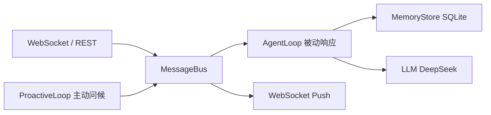

<!-- description: AI README 必读入口 - 项目规则导航；任何任务前先读此文件 -->

# AI README - 项目规则入口

## 项目总览

MindMate 是一个主动式 AI 心理陪伴 Agent，模拟真人好友的对话质感、情绪记忆与有分寸的主动关心。基于 FastAPI + WebSocket 实时双向通信，搭载 DeepSeek LLM + SQLite 记忆持久化 + MCP 工具扩展，配套面向咨询师的六维可视化后台。

## 生成信息
- 生成时间：2026-07-02
- 生成分支：N/A (无 git 仓库)

## 快速导航

### AI 生成文档
- [x] [项目结构](./generated/项目结构.md) - 目录树、模块划分；了解代码组织时使用 (2026-07-02)
- [x] [技术架构](./generated/技术架构.md) - 分层架构、技术栈；了解技术选型时使用 (2026-07-02)
- [x] [开发指南](./generated/开发指南.md) - 环境搭建、构建/启动命令；上手时使用 (2026-07-02)
- [x] [核心流程](./generated/核心流程.md) - 主要业务调用链；理解系统时使用 (2026-07-02)

### 人工维护文档
- [ ] [业务知识](./manual/业务知识.md) - 项目背景、领域术语、业务规则
- [ ] [历史经验](./manual/历史经验.md) - 踩坑记录；写代码前必读
