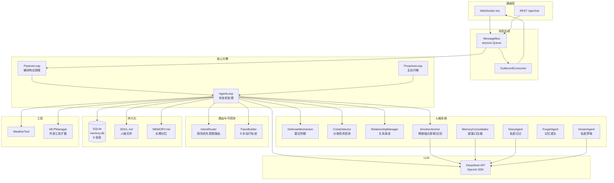

<!-- description: 技术架构 - 分层架构和技术栈清单；当需要了解技术选型时使用 -->

<!-- AI生成，可根据团队规范更新 -->
# 技术架构

## 架构总览

## 分层说明
| 分层 | 职责 | 主要类/文件 |
| --- | --- | --- |
| 通道层 | 接收用户输入（WebSocket 全双工 / REST 备用），推送回复 | `web/app.py:websocket_endpoint`, `create_app` |
| 消息总线 | 解耦通道与核心引擎，异步队列路由 | `bus/events.py:MessageBus` |
| 核心引擎 | 被动响应状态机 + 主动关心循环 + 意图路由 + 运行轨迹 | `agent/loop.py:AgentLoop`, `proactive/loop.py:ProactiveLoop`, `agent/router.py:IntentRouter`, `agent/trace.py:TraceBuilder` |
| 人格系统 | 对话安全边界、情感记忆、关系演进、内在生活 | `personality/` 下 8 个模块 |
| 持久化 | 时间线日志、情绪锚点、关系阶段、预警、轨迹、日记、梦境（SQLite） + 人格/长期记忆（Markdown 文件） | `memory/store.py:MemoryStore` |
| LLM 层 | DeepSeek API 调用（兼容 OpenAI SDK） | `llm/deepseek.py:DeepSeekProvider` |
| 工具层 | 内置天气工具 + MCP 协议扩展 + 危机检测 | `tools/` 下 4 个模块 |

## 技术栈
| 类目 | 技术 | 版本 | 用途 |
| --- | --- | --- | --- |
| 语言/运行时 | Python | >=3.11 | 主语言 |
| 主框架 | FastAPI | >=0.115.0 | Web 服务框架 |
| ASGI 服务器 | uvicorn | >=0.30.0 | 异步 HTTP/WS 服务 |
| 实时通信 | WebSocket (websockets) | >=14.0 | 双向实时对话 |
| LLM 调用 | openai SDK | >=1.50.0 | DeepSeek API 调用 |
| 数据校验 | pydantic | >=2.0 | 类型/数据验证 |
| HTTP 客户端 | httpx | >=0.28.0 | 异步 HTTP（MCP 等） |
| 数据库 | SQLite (标准库 sqlite3) | 内置 | 所有结构化持久化 |
| 日志 | loguru | >=0.7.0 | 结构化日志 |
| 配置 | python-dotenv | >=1.0.0 | .env 环境变量 |
| 测试框架 | pytest | >=8.0 | 单元测试 |
| 异步测试 | pytest-asyncio | >=0.24.0 | async 测试支持 |
| 代码规范 | ruff | >=0.8.0 | Lint + 格式化 |
| 构建 | hatchling | 内置 | PEP 621 构建 |
| MCP 扩展 | mcp | >=1.0.0 | 可选，外部工具协议 |
