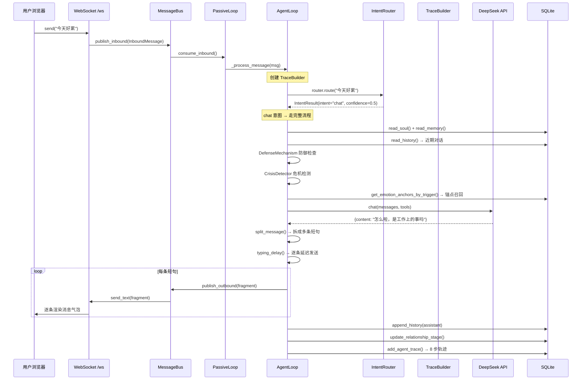
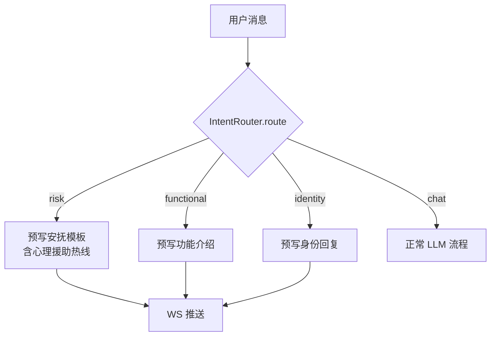
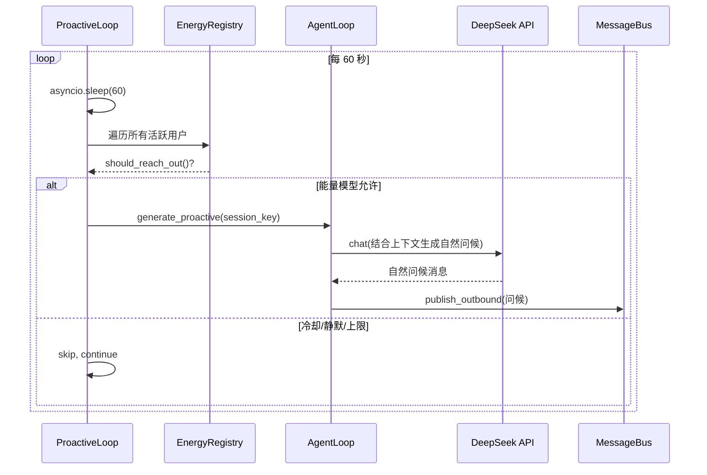
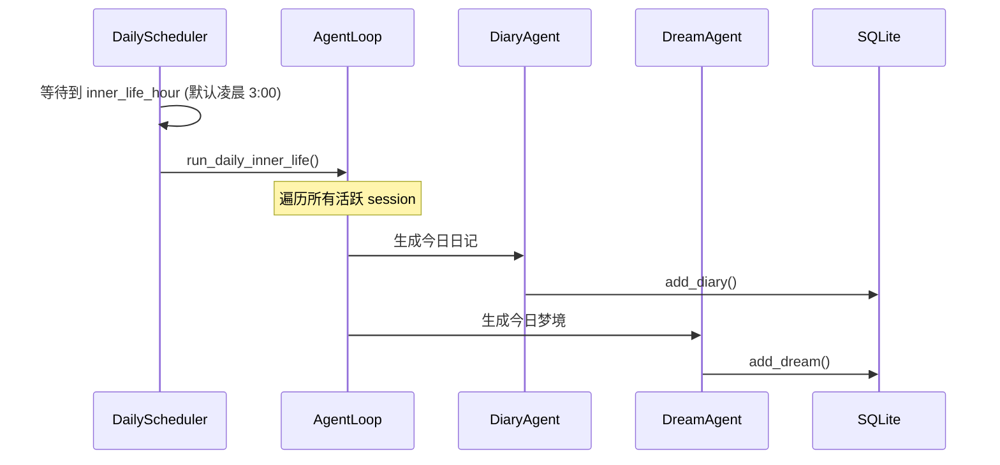
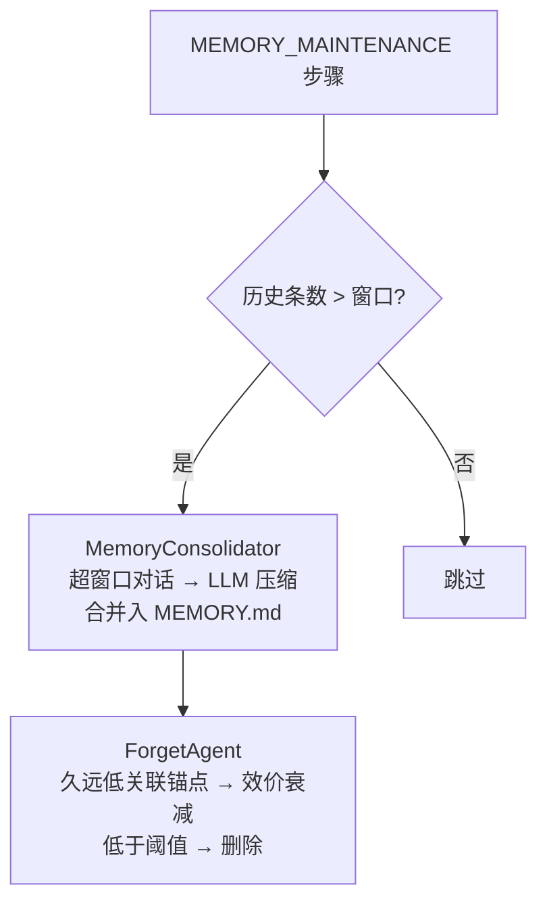

<!-- description: 核心流程 - 主要业务调用链；当需要理解系统运作时使用 -->

<!-- AI生成，可根据团队规范更新 -->
# 核心流程

> 提示：以下流程由 AI 从代码推断而来，请用户确认 P0/P1 是否就是团队认知中的核心。

## 流程清单
| 优先级 | 流程名 | 入口 | 备注 |
| --- | --- | --- | --- |
| P0 | 被动对话响应 | `PassiveLoop.run()` → `AgentLoop._process_message()` | 核心链路，每条用户消息必经 |
| P0 | 主动问候推送 | `ProactiveLoop.run()` → `AgentLoop.generate_proactive()` | 定时触发，能量模型控制 |
| P1 | 每日内在生活 | `DailyScheduler.run()` → `AgentLoop.run_daily_inner_life()` | 日记/梦境自动生成 |
| P1 | Dashboard 只读查询 | `GET /api/dashboard/*` | 医生后台，6 个 API 端点 |

## 流程 1：被动对话响应 (P0)

### 调用链
1. `web/app.py:websocket_endpoint` — 接收 WS 消息
2. `bus/events.py:MessageBus.publish_inbound` — 入队
3. `proactive/passive.py:PassiveLoop.run` — 调度消费
4. `agent/loop.py:AgentLoop._process_message` — 核心处理（下述 8 步）
5. `agent/router.py:IntentRouter.route` — 意图路由（步骤 0，在 LLM 前）
6. `agent/loop.py:AgentLoop._build_context` — 构建上下文（SOUL + 防御 + 危机 + 锚点 + 历史 + 内在生活）
7. `agent/loop.py:AgentLoop._run_llm` — 调用 LLM（含工具调用循环）
8. `utils/splitter.py:split_message` — 长回复拆短句
9. `utils/splitter.py:typing_delay` — 打字延迟
10. `bus/events.py:MessageBus.publish_outbound` — 出队推送
11. `web/app.py:_outbound_consumer` — WS 发送

### AgentLoop 8 步运行轨迹（TraceBuilder 插桩点）
| 序号 | 步骤名 | 位置 | 详情 |
| --- | --- | --- | --- |
| 0 | `INTENT_ROUTE` | `_process_message` 开头 | 规则路由决策（在 LLM 前） |
| 1 | `DEFENSE_CHECK` | `_build_context` | 雷区防御是否触发 |
| 2 | `CRISIS_CHECK` | `_build_context` | 危机检测等级 |
| 3 | `ANCHOR_RECALL` | `_build_context` | 情绪锚点召回命中数 |
| 4 | `INNER_LIFE_SHARE` | `_build_context` | 内在生活分享冲动 |
| 5 | `LLM_CALL` | `_run_llm` | LLM 主调用 |
| 6 | `TOOL_CALL` | `_run_llm` 工具循环 | 每次工具调用 |
| 7 | `RELATIONSHIP_UPDATE` | `_process_message` 末尾 | 关系阶段变更 |
| 8 | `MEMORY_MAINTENANCE` | `_process_message` 末尾 | 记忆维护触发 |

### 意图路由快速路径（跳过 LLM）

## 流程 2：主动问候推送 (P0)

### 能量模型决策维度
| 维度 | 控制参数 | 说明 |
| --- | --- | --- |
| 沉默时长 | `silence_threshold` | 用户多久没说话才适合主动 |
| 冷却时间 | `cooldown` | 两次主动推送的最小间隔 |
| 安静时段 | `quiet_hours` | 深夜/凌晨不打扰 |
| 每日上限 | `daily_limit` | 每天最多主动开口次数 |

## 流程 3：每日内在生活 (P1)

## 流程 4：长期记忆维护 (后台触发)

