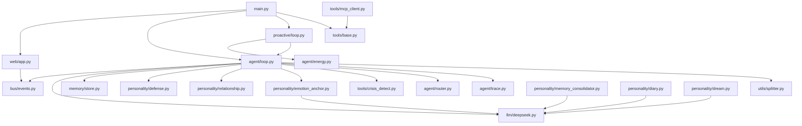

<!-- description: 项目结构 - 目录树、模块划分、依赖关系；当需要了解代码组织时使用 -->

<!-- AI生成，可根据团队规范更新 -->
# 项目结构

## 目录树
```text
mindmate/
├── main.py                    # 入口：启动 Web 服务 + 双循环 + 调度器
├── agent/
│   ├── loop.py                # AgentLoop 核心引擎（被动响应状态机）
│   ├── router.py              # IntentRouter 意图路由器（规则优先）
│   ├── trace.py               # TraceBuilder 运行轨迹（可观测性）
│   ├── energy.py              # EnergyRegistry 能量模型（per-user 沉默/冷却）
│   └── scheduler.py           # DailyScheduler 每日内在生活调度
├── bus/
│   └── events.py              # MessageBus 异步消息总线 + InboundMessage/OutboundMessage
├── channels/
│   └── __init__.py            # 通道抽象（当前 Web 通道由 web/app.py 提供）
├── llm/
│   └── deepseek.py            # DeepSeekProvider (OpenAI SDK 兼容)
├── memory/
│   └── store.py               # MemoryStore SQLite 持久化（8 张表）
├── personality/
│   ├── soul.py                # SOUL.md 人格核心管理
│   ├── defense.py             # DefenseMechanism 雷区防御
│   ├── relationship.py        # RelationshipManager 关系阶段演进
│   ├── emotion_anchor.py      # EmotionAnchorManager 情绪锚点提取/召回
│   ├── memory_consolidator.py # MemoryConsolidator 超窗口对话压缩
│   ├── diary.py               # DiaryAgent 私密日记子 Agent
│   ├── dream.py               # DreamAgent 私密梦境子 Agent
│   └── forget.py              # ForgetAgent 久远记忆弱化
├── proactive/
│   ├── loop.py                # ProactiveLoop 主动关心循环（能量驱动）
│   └── passive.py             # PassiveLoop 被动响应调度
├── tools/
│   ├── base.py                # ToolRegistry 工具注册表
│   ├── weather.py             # WeatherTool 天气查询
│   ├── crisis_detect.py       # CrisisDetector 分级心理风险检测
│   └── mcp_client.py          # MCPManager MCP 协议客户端
├── utils/
│   └── splitter.py            # 消息拆分 + 打字延迟 + 思考延迟
├── web/
│   ├── app.py                 # FastAPI 应用（WS + REST + Dashboard API）
│   └── static/
│       ├── index.html         # 聊天页面（WebSocket 实时通信）
│       └── dashboard.html     # 医生后台（情绪趋势/风险预警/对话回放/轨迹/上下文指标）
└── config/
    └── settings.py            # Settings 全局配置（.env 加载）

tests/
├── test_agent.py              # AgentLoop 核心流程测试
├── test_router.py             # IntentRouter 路由测试（18 个）
├── test_trace.py              # Run Trace 可观测性测试（10 个）
├── test_context_stats.py      # 上下文指标测试（6 个）
├── test_defense.py            # 防御机制测试
├── test_relationship.py       # 关系阶段测试
├── test_emotion_anchor.py     # 情绪锚点测试
├── test_memory_consolidator.py# 记忆压缩测试
├── test_diary_dream.py        # 日记/梦境测试
├── test_crisis.py             # 危机检测测试
├── test_energy.py             # 能量模型测试
├── test_proactive.py          # 主动循环测试
├── test_scheduler.py          # 调度器测试
├── test_splitter.py           # 消息拆分测试
├── test_tools.py              # 工具调用测试
├── test_multiuser.py          # 多用户隔离测试
└── test_basic.py              # 基础功能测试
```

## 模块职责
| 目录 | 职责 | 关键文件 |
| --- | --- | --- |
| `agent/` | 核心处理引擎：消息处理、路由、可观测性、能量 | `loop.py` (AgentLoop), `router.py`, `trace.py` |
| `bus/` | 异步消息总线，解耦通道与核心 | `events.py` (MessageBus) |
| `llm/` | LLM 调用封装 (DeepSeek via OpenAI SDK) | `deepseek.py` (DeepSeekProvider) |
| `memory/` | SQLite 持久化：历史、锚点、关系、轨迹 | `store.py` (MemoryStore, 8 张表) |
| `personality/` | 人格系统：防御、关系、情绪记忆、内在生活 | `defense.py`, `emotion_anchor.py`, `diary.py` |
| `proactive/` | 主动行为：能量模型驱动定时问候 | `loop.py` (ProactiveLoop) |
| `tools/` | 工具调用：天气、危机检测、MCP 扩展 | `base.py`, `crisis_detect.py`, `mcp_client.py` |
| `web/` | FastAPI + WebSocket 实时通信 + Dashboard | `app.py`, `dashboard.html` |
| `config/` | 全局配置 + .env 加载 | `settings.py` |

## 模块依赖关系

